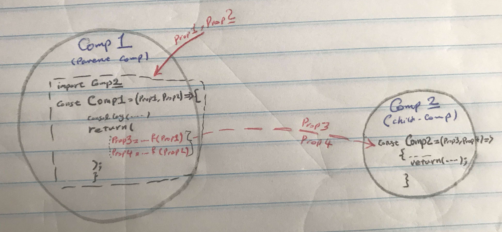
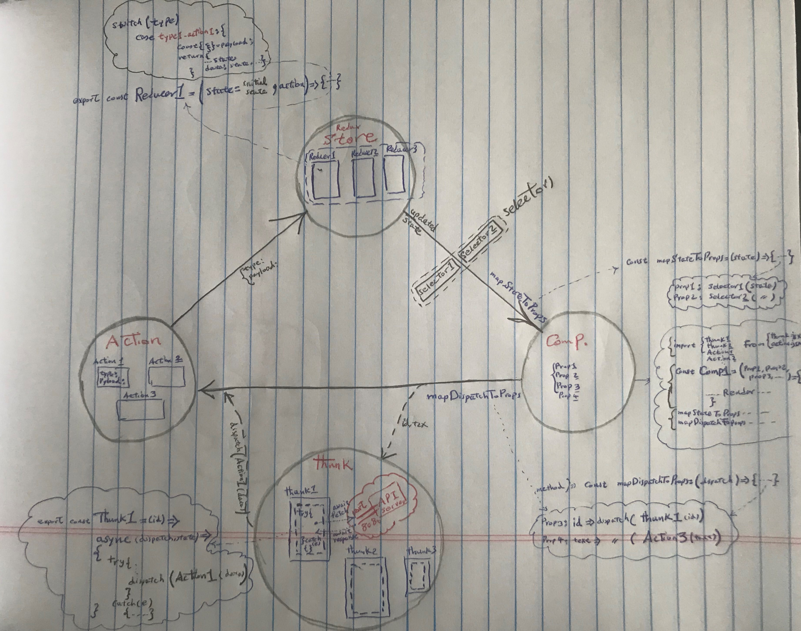
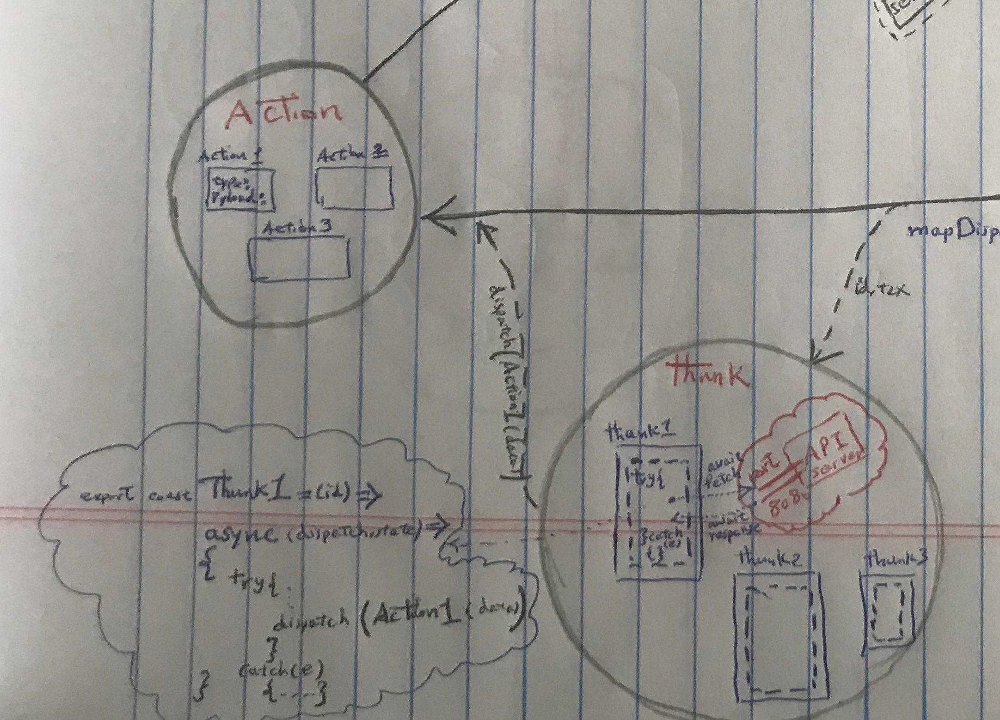
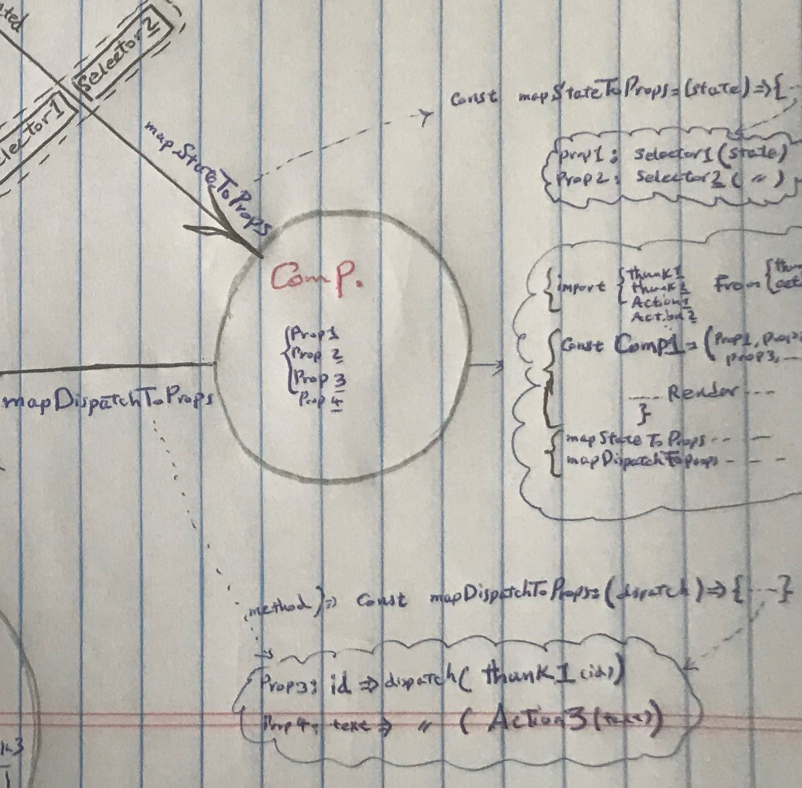
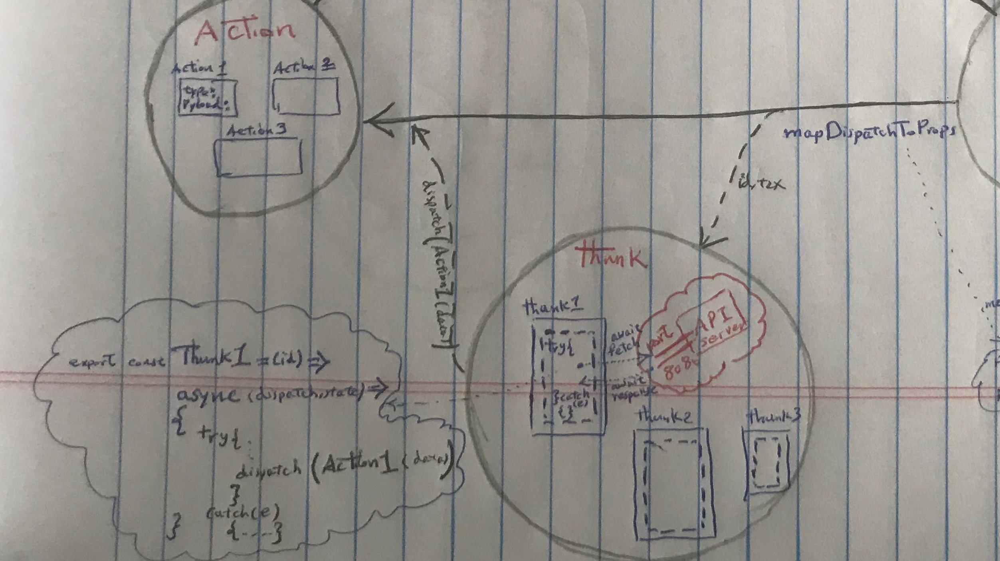

# `Code Descriptions`

## **1 - Basic Vanilla React: No Redux**

_In this basic version, Redux-store concept will not be used. There is no concept of "store", "action" or "reducer" concept_

_**What We Want to Design**_: A list of of todo (which we can call it todos list). In each todo, there will be two buttons: (1) Remove, and (2) Mark it As Complete. Also, there should be an option for user to enter a new todo item to the list, with "Add" button.

_Point about Functional Component:_

- Since a functional component is just a plain JavaScript function, you cannot use setState() in your component. That’s the reason why they also get called functional stateless components. So everytime you see a functional component you can be sure that this particular component doesn’t have its own state.
- Another feature which you cannot use in functional components are lifecycle hooks.
- In functinoal components, everything goes into a component as a property (in the input argument)

_Some installation:_

- npm install --save-dev @babel/core @babel/cli @babel/preset-env @babel/preset-react ==> then create .babelrc file

- npm install --save-dev react-hot-loader => then import {hot} into the App.js

### **1-a - What to expect at this section**

It will be just a vanilla react-app that only shows the default todo-list items, and none of button fires
any event.

_Point: Local Storage for the app:_ In the browser, inspect it, then on the Application tab, you ca ngo to Local storage, http://localhost:3030, and see all the todo's we initially passed to the parent component "TodoList".



---

## **2 - App with Redux**

_**Goal**_: Separation of concerns and "having one single/global state:

- Components => Display Data
- Reducers => Manage Data (make changes to the state)
- Action => Source/Pyloads of information from app to store/reducers
- (Later topic) Thunk => Side effect logics => a piece between "Component" and "Action"

_Some installation:_

- npm install redux react-redux

-



### **Steps**

Usually, we can start from "redux-store". HOwever, we know redux-store contains "reducer(s)". Payload/Source of information for "reducer(s)" is "action.js". So, let's start with creating "action.jsx".

- _**step 2-1: Action.js:**_ Action.js is the source/payload of data/information to be sent to "reducer(s)" in the store, based on the dispatch recieved from component.

  - Let's assume we have 3 types of actions (based on 3 buttons defined in the app).
  - create_todo_action, remove_to_action, mark_to_do_as_completed_action
  - an action is simply a function that gets an "id" or a "text" dispatched form the component, to have that in the payload.
  - an action is a dictionary that contains "type" and "payload" as keys. As an example, one of them would be like this:

    ```javascript
    export const CREATE_TODO = " CREATE_TODO";
    export const create_todo_action = (text) => ({
      type: CREATE_TODO,
      payload: { text },
    });
    ```



- _**step 2-2: Reducer.js:**_ Similar to action.js that could have many actions in it, reducer.js can also include many reducers that our app requires.

  - A reducer take (action, state) as input to the function, and based on the dispatched action, updates the state, and returns the updated state.
  - A reducer, usually, uses "switch-case" scenario to go through actions. ==> Thus, actions, must be imported to the reducer.js.
  - In reducer, we should know how our state structure looks like. For now, let's assume our structure have "text" and "isComplete"
  - a common mistak: In "const { text } = payload;" we cannot rename the "text", we determined "text" to be one of member of the state.

    ````javascript
    export const todo_reducer_1 = (state = [], action) => {
      const { type, payload } = action;
      switch (type) {
        case CREATE_TODO: {
          //load the payload info to text. Do not rename "text" to anything else.
          const { text } = payload;
          // create a new item, based on incoming pyload
          const new_todo_item = {
            text,
            isComplete: false,
          };
          // include the new item into the state
          return state.concat(new_todo_item);
        }
        default:
          return state;
      }
    };
      ```

    
    ````

* _**step 2-3: Store.js:**_ After creating all possible reducer(s), now we can shape the store.js.

  - A basic store: (I) import all the defined reducer(s) from reducer.js, (II) combine all reducer(s) and create a rootReducer, (III) create the store based on the rootReducer (sometimes it is called, configuring the store)

    ```javascript
    import { createStore, combineReducers } from "redux";
    import { todo_reducer_1 } from "./todos/01_redux/reducer.js";
    // combine all impoerted reducer(s) to create a "root-reducer"
    const reducers = { todo_reducer_1 };
    const rootReducer = combineReducers(reducers);
    // create te store
    export const config = () => createStore(rootReducer);
    ```

- _**step 2-4: index.js:**_ After creating all possible reducer(s), now we can shape the store.js.

  - index.js is where the "App.js" with all its child-comp's gets rendered. In redux system: (I) we should import the created store (configStore), (II) we should wrapp the index.js with a "provider" so that the index.js is wrapped with the store.

    ```javascript
    import { Provider } from "react-redux";
    import { storeConfig } from "./store.js";
    // import the created store, to wrap the index.js with the store
    const redux_store = storeConfig();
    ReactDOM.render(
      <Provider store={redux_store}>
        <App />
      </Provider>,
      document.getElementById("root")
    );
    ```

- _**step 2-5: Connect Components to store and action units:**_ After getting the redux-store and action units done, we need to connect compnents to these 2 units, to get the updated states based on released/dispacthed action. Basically, only those component that need direct access to the updated state must be connected, not all of them.

  - 1st point is that in functional component, every informatino goes into the component as property, through input argument. There is no "setState()" concept.
  - In our App, in "TodoList" component, we need updated state to send it over to the child-component, "TodoListItem" component. Also, when in "TodoListItem", either the "Remove" button or "Mark As Complete" button get hit, a dispatch is realsed from "TodoList" to the action unit, and at the end it ends up with updating the state based on dispatch in the redux-store.
  - Similarly, in the "NewTodoForm", we need to connect it to "redux-store" and "action" units, so that it can dispatch an action upong hitting the "Create Todo" button.
  - From another perspective, in any component, we might need:

    - An updated state: => mapStateToProps
    - To fire/dispatch an action: => mapDispatchToProps



- _***step 2-5-1: connect "TodoList":***_

      - This component needs to get the updated state to send it over to "TodoListItem" child-comp
      - Also, it needs to dispatch 2 actions for 2 buttons in the child-comp "TodoListItem"; one for "Remove" button and also for "Mark As Complete" button
      - "state" and "dispatch" are 2 known values, when we import {connect} from react-redux. No need for an explicit import for "state" and "dispatch".

  ```javascript
  import { connect } from "react-redux";
  import { remove_todo_action, mark_todo_as_completed } from "./action";

  // all properties will be as input arguments
  const TodoList = ({
    updated_state_from_reducer,
    onRemovedPressed_prop,
    onCompletedPressed_prop,
  }) => {
    // use input ptoperties to pass to the child-comp, or use for itself
    return <div className="list-wrapper"></div>;
  };

  // what section of the updated state should be used for this component
  const mapStateToProps = (state) => ({
    updated_state_from_reducer: state.todo_reducer_1,
  });

  // what should be dispacthed(ACTION_X) to update the state in the reducers in the store
  const mapDispatchToProps = (dispatch) => ({
    onRemovedPressed_prop: (text) => dispatch(remove_todo_action(text)),
    onCompletedPressed_prop: (text) => dispatch(mark_todo_as_completed(text)),
  });

  export default connect(mapStateToProps, mapDispatchToProps)(TodoList);
  ```

- _***step 2-5-2: connect "NewTodoForm":***_

      - Similar to "TodoList" component, "NewTodoForm" requires a direct access to the updated state, and also needs to dispatch an action for "remove" button.

  ```javascript
  // get a pieceo of updated state
  const mapStateToProps = (state) => ({
    updated_state_from_reducer: state.todo_reducer_1,
  });
  // dispatch an action for "create todo" button
  const mapDispatchToProps = (dispatch) => ({
    onCreatePressed_prop: (text) => dispatch(create_todo_Action(text)),
  });
  // connecting this component to the redux-store and action units
  export default connect(mapStateToProps, mapDispatchToProps)(NewTodoForm);
  ```

---

## **3 - App with Redux and Persistency**

_**Goal**_: In the App developed in section 2 above, all the data will dosapear upon refreshing the page. We want to make the data persistent.

- Local Data Storage: Browser -> inspect -> Application Tab -> Local Storage -> http://localhost:3000
- Logically, we should be able to persist the reducer part of the store to keep the data.
- There is a level of persistency (we use level2)
- Redux Devtool: Install the Redux DevTool in Chrom: Google for "redux extension chorom"

  - Coonect our app-store to this Chrome extension: go to "store.js" and add the following to the configStore:

    ```javascript
    // adding the chrome extension to the redux-store for debugging pueposes
    export const configStore = () =>
      createStore(
        rootReducer,
        window.__REDUX_DEVTOOLS_EXTENSION__ &&
          window.__REDUX_DEVTOOLS_EXTENSION__()
      );
    ```

_Some installation:_

- npm install redux-persist

### **Steps**

- _**step 3-1: store.js:**_ The reducer in the store needs to be persisted. We also need to import an "storage" to save the data for persistency.

  ```javascript
  import { persistReducer } from "redux-persist";
  import { storage } from "redux-persist/lib/storage";
  import automergeLevel2 from "redux-persist/lib/stateReconciler/autoMergeLevel2";

  const reducers = { todo_reducer_1 };
  const rootReducer = combineReducers(reducers);
  // config the persistency, with the specified storage location and the level of persistency
  const persistencyConfig = {
    key: "root",
    storage,
    stateReconciler: automergeLevel2,
  };
  // create the persistent reducer to create the store
  const persistentReducer = persistReducer(persistencyConfig, rootReducer);
  // cretae the store based on the persistent reducer
  export const storeConfig = () =>
    createStore(
      persistentReducer,
      window.__REDUX_DEVTOOLS_EXTENSION__ &&
        window.__REDUX_DEVTOOLS_EXTENSION__()
    );
  ```

- _**step 3-2: index.js:**_ Before persistency, we had to wrap our App component in index.js with our redux-store. Now with persistency, we also need to wrapp the App with "persistGate" and a "persistStore".

  ```javascript
  import { persistStore } from "redux-persist";
  import { PersistGate } from "redux-persist/lib/integration/react";
  // make the store persistent
  export const redux_store = storeConfig();
  const persistentReduxStore = persistStore(redux_store);
  // wrap the App with persistGate, in which a persistent redux is included
  ReactDOM.render(
    <Provider store={redux_store}>
      <persistGate
        persistor={persistentReduxStore}
        loading={<div> Loading... </div>}
      >
        <App />
      </persistGate>
    </Provider>,
    document.getElementById("root")
  );
  ```

---

## **5 - Thunk \_ side effect libraries**

_**Goal**_: An App that all data interations (reading/Saving) happens into/from a server. There are several required interactions: (I) in the interaction with the external server we want 3 sctions: loadTodoInProgress, loadTodoSucess, loadTodoFailure, (II) create_todo, remove_todo, mark_as_acompleted buttons will dispatch into thunk first to get/send data from/to sever, then will be dispatched into the action-unit.

_Point:_
If there are some logics (or side-effects) in the workflow of the app, we can use "thunk" concepts. As an example, if we want to read/store data into a separate server (server8080), we can have this part in the thunk. Normally, we dispatch an action from a component to atcion unit. Sometimes, we can dispatch an action into a thunk, and then thunk des its job (fetch the data from the server) and then dispatch it into action unit. In that sense, thunk unit is somewhere between component and action unit.




_Some installation:_

- npm install redux-thunk redux-devtools-extension @babel/runtime
- npm install --save-dev @babel/plugin-transform-runtime
- have the .babelrc into our project

### **Steps**

- **step 5-0: Add a local server for saving data (localhost:8080):**

  - This is a server that provides us a port (8080) to transfer data into/from it.
  - Look at the folder "react-ecosystem-server" folder, where in the src/server.js. It is a simple REST API that allows us creat, read, update and delete TodoItems "stored in memory on the server". Some end-points are defined to communicate with this server:
    - example of end-points: "GET /todos", "POST /todos", "POST /todos/:id/completed", "DELETE /todos/:id"
    - Go to this folder and install this server, so this server can serve us with 8080 port:
      - npm install
      - npm run start
      - we should see the message: "server listening on port 8080"

* **step 5-1: changes in action.js:**

  - Since we will be reading/writing from/into a server, we want to add actions somehow related to "loadingTodos":

    - load_todos_in_progress_action => no particuler action
    - load_todos_failure_action => no particuler action
    - load_todos_success_action => get the todos and put them into the payload. As an example we put ths action below:
      ```javascript
      //  for loading todos from server8080
      export const LOAD_TODOS_SUCCESS = "LOAD_TODOS_SUCCESS";
      export const load_todos_success_action = (todos) => ({
        type: LOAD_TODOS_SUCCESS,
        payload: { todos },
      });
      ```
    - unlike previously, since all actions get dispatched from thunk, the input to the action would be a todo, not text. For instace:

      ```javascript
      export const REMOVE_TODO = " REMOVE_TODO";
      // th input arguent is what argument dispatached from thunk. Previously we used to get "taxt"
      export const remove_todo_action = (todo) => ({
        type: REMOVE_TODO,
        payload: { todo },
      });
      ```

- Some fake data is available in server8080 for initialization. This shows the elements of out todo-items:
  ```javascript
  var fakeTodos = [{
      id: 'ae06181d-92c2-4fed-a29d-fb53a6301eb9',
      text: 'Learn about React Ecosystems',
      isCompleted: false,
      createdAt: new Date(),
  }
  ```

* **step 5-2: Add thunk.js:**

  - Since the final goal in a thunk is to dispatch an action from the action-unit, we need ti import those actions from action-unit.
  - Each thunk, is basically a function, in which another async-function in which (dispatch, state) are 2 input arguments into the async-function.
  - we want the following thunks to have interation with server8080:

    - thunk "load_todo_thunk": to dispatch one the following actions:
      - loadTodosInProgress
      - loadTodosSuccess
      - loadTodosFailure
    - thunk "add_todo_request_thunk": to dispatch "create_todo_action" when we hit the Creat Todo button.
    - thunk "remove_todo_request_thunk": to dispatch "remove_todo_action" when we hit the Remove button.
    - thunk "mark_todo_as_completed_thunk": to dispatch "mark_todo_as_completed" when we hit the Remove button.
      following code is an example of what we have in thunk.js, for "add_todo_request_thunk":

    ```javascript
    export const add_todo_request_thunk = (text) => async (dispatch) => {
      try {
        // make the incoming text into jason, so it can be sent/posted to the server
        const body = JSON.stringify({ text });
        const response = await fetch("http://localhost:8080/todos", {
          headers: {
            "Content-Type": "application/json",
          },
          method: "post",
          body,
        });
        // get the response back
        const todo = await response.json();
        // dispatch the recieved response (todo) to the action unit
        dispatch(create_todo_Action(todo));
      } catch (e) {
        dispatch(displayAlert(e));
      }
    };
    ```

* _**step 5-3: Add thunk-Dev tools (store.js):**_ Redux-Thunk is a middleware that lets us "asynchronously" call action creators that return a function instead of an action object. We apply the following in te store.js, in the "create store" stage, so we can have access to dev tools:

  ```javascript
  export const storeConfig = () =>
    createStore(
      persistedReducer,
      //previously we used => window.__REDUX_DEVTOOLS_EXTENSION__ && window.__REDUX_DEVTOOLS_EXTENSION__()
      composeWithDevTools(applyMiddleware(thunk))
    );
  ```

* _**step 5-4: changes in reducer.js:**_ Since we made changes in action unit (added some new actions), we need to make appropriate changes in the reducer.js.

  **_Fundamental Change:_**

  - previously, reducer was a place, we applied some logics based on the dispatched action, to get an updated state. For instance, upon dispatch an action for adding a new todo item, we had to make a new todo_item with 2 elements: text and isComplete=false.
  - Since, now we read the data from server, all elements (i.e. id, text, isComplete, ..) for one todo is coming with the payload to the reducer.
  - We need to make changes to the logic of each switch-case, based on the 2 above facts.

  - _***step 5-4-1:"***_ Import all newly added action types (all about the loading data from server8080).
  - _***step 5-4-2:"***_ Simplified logic for each switch-case inside the reducer. The whole would be that now our payload contains one todo with all elements. For instance, for "CREATE_TODO":

    ```javascript
    "CREATE_TODO" case:
      // current logic for adding a todo item, came from server 8080
      case CREATE_TODO: {
        const { todo } = payload;
        return state.concat(todo);
      }
      // previous (obselete) logic to add a todo item. We needed to create all elements (text, isComplete) of one todo item
      case CREATE_TODO: {
        const { text } = payload;
        const new_todo_item = {
          text,
          isComplete: false,
        };
        return state.concat(new_todo_item);
      }
    ```

- _***step 5-4-3:"***_ NEW REDUCER: We want to create a new reducer "isLoading_reducer", that only has loading-from-server related action-types ( LOAD_TODOS_IN_PROGRESS, LOAD_TODOS_SUCCESS, LOAD_TODOS_FAILURE,). The purpose is that this reducer return true for "LOAD_TODOS_IN_PROGRESS" action-type, and the other 2 returns false.

  ```javascript
  export const isLoading_reducer = (state = false, action) => {
    const { type } = action;

    switch (type) {
      case LOAD_TODOS_IN_PROGRESS:
        return true;
      case LOAD_TODOS_SUCCESS:
        return false;
      case LOAD_TODOS_FAILURE:
        return false;
      default:
        return state;
    }
  };
  ```

* _**step 5-5: changes in store.js:**_ Let's add the newly added dreducer [isLoading_reducer] into our redux-store.

- add the new reducer to the store .Following is the addition to the old code:

  ```javascript
  import {
    todo_reducer_1,
    isLoading_reducer,
  } from "./todos/01_redux/reducer.js";
  const reducers = { todo_reducer_1, isLoading_reducer };
  ```

* _**step 5-6: Connecting the Components:**_ Now that we made changes in thunk.js, action.js, reducer.js, store.js, we need to make changes in connecting-components accordingly:

  **_Fundamental Change:_**

  - previously, r

  - _***step 5-6-1: TodoList Comp"***_ Previously, this component was only connected through Action unit. In thi component, we want three things: (I) one for Remove button, (II) one for mark-it-as-complete button, and (III) one for isLoading-from_server.

    - Using "useEffect" Hook:

      - The "Effect" Hook lets use perform side-effects in our function components. By using this Hook, you tell React that your component needs to do something after render.
      - import {useEffect} to the component, and use the following at the begining of our functional component:
        ```javascript
        useEffect(() => {
          startLoadingTodos();
        }, []);
        ```

    - all three required actions happends through "thunk" unit. So, no need direct access to action.js unit.
      ```javascript
      // old import. No need to direct access to action.js unit
      /// import { remove_todo_action, mark_todo_as_completed } from "./action";
      // all required props can be through the thunk.js uni
      import {
        load_todo_thunk,
        remove_todo_request_thunk,
        mark_todo_as_completed_thunk,
      } from "./thunk.js";
      ```
    - changes in the "mapStateToProps" and "mapDispatchToProps". With 2 reducers in the store, now we have 2 sources of state:

      ```javascript
      const mapStateToProps = (state) => ({
        updated_state_from_reducer: state.todo_reducer_1,
        isoading: state.isLoading_reducer_2,
      });

      const mapDispatchToProps = (dispatch) => ({
        onRemovedPressed_prop: (id) => dispatch(remove_todo_request_thunk(id)),
        onCompletedPressed_prop: (id) =>
          dispatch(mark_todo_as_completed_thunk(id)),
        startLoadingTodos: () => dispatch(load_todo_thunk()),
      });
      ```

    - Modify the input argument to the comp-function (wich are the props to the component), based on the changes we made into "mapStateToProps" and "mapDispatchToProps":

      - "isoading" and "startLoadingTodos" are 2 new props must be added into the input argument

    - Changes in the Render part of the component:

      - "isoading" input props: We want our component to show a message "Is Loading ..." if it is reading from server, otherwise do the old rendering part.

        ```javascript
        const TodoList = ({
          updated_state_from_reducer = inistialState,
          onRemovedPressed_prop,
          onCompletedPressed_prop,
          isoading,
          startLoadingTodos,
        }) => {
          // We say to React that the component needs to do some browser-API call after render
          useEffect(() => {
            startLoadingTodos();
          }, []);
          // a message for the time itt is waiting while loading from server8080
          const loading_message = <div> Loading todos... </div>;
          // main render part
          const rendered_content = (
            <div className="list-wrapper">
              <NewTodoForm />
              {updated_state_from_reducer.map((todo_item) => (
                <TodoListItem
                  todo={todo_item}
                  onRemovedPressed_prop={onRemovedPressed_prop}
                  onCompletedPressed_prop={onCompletedPressed_prop}
                />
              ))}
            </div>
          );
          // what to render: the loasing message, or the actual component
          return isoading ? loading_message : rendered_content;
        };
        ```

- _***step 5-6-2: TodoListItem Comp"***_ "onCompletedPressed_prop" and "onRemovedPressed_prop" are 2 props in this component that now needs to pass the "id" of each todo item, rather than "text".

- _***step 5-6-3: NewTodoForm Comp"***_ Previously, this component was connected directly to "create_todo_Action". Now, it should dispatch the "add_todo_request_thunk" first, inside the thunk this dispatch will dispatch "create_todo_Action" after writing the new item into the server 8080:

  ```javascript
  const mapDispatchToProps = (dispatch) => ({
    onCreatePressed_prop: (text) => dispatch(add_todo_request_thunk(text)),
  });
  ```

```
# to do later
```
